  

  

> *"You don't have to love life right now. Just give yourself a chance to make it to tomorrow morning."*
> — The Cat Lady

**Programming & markup**

  
  
  
  
  
  
  
  

**Operating systems**

  
  
  
  
  
  

**Tools**

  
  
  
  

**Knowledge**

- Network protocols, packet capture and traffic analysis (Python)
- Information security fundamentals and the Information Security Doctrine of Russia
- FSTEC requirements
- Information security legislation
- Banking and financial sector basics

**Soft skills**

Attention to detail · Risk assessment · Idea generation · Reliability & punctuality · Stress resistance · Teamwork · Leadership

**Languages**

English (A2) · Spanish (-)

<!-- If the stats card doesn't load (the public server is sometimes overloaded),
     delete the whole STATS block: the profile looks fine without it. -->

  

