  

  
  
  
  

Учусь на информационной безопасности, копаюсь в кибербезопасности, автоматизации и Python.
🐈‍⬛ Кет-леди по призванию.

- 🔐 Изучаю кибербезопасность: лабы, CTF, разбор уязвимостей
- 🛠️ Пишу небольшие утилиты и скрипты для автоматизации
- 📚 Оформляю write-up'ы по пройденному

  
  
  
  
  

| Проект | Что делает |
|---|---|
| [b24-1-schedule](https://github.com/i-kiki/b24-1-schedule) | Подписной календарь с парами для Apple/Google Календаря, обновляется автоматически |
| [проект 2](https://github.com/i-kiki?tab=repositories) | Короткое описание в одну строку |
| [проект 3](https://github.com/i-kiki?tab=repositories) | Короткое описание в одну строку |

  

<!-- Если карточка статистики не грузится (публичный сервер иногда перегружен),
     удали блок STATS целиком: профиль без него выглядит нормально. -->

  

